# Flower Shot システム構成図・DB構造・ER図・ユースケース図

最終更新日: 2026-05-01
対象読者: 非エンジニア（保護者、先生、マネージャー等）

> このドキュメントでは、Flower Shot アプリの全体像を図で説明します。
> 各図は **Mermaid** という記法で書かれており、GitHub 上で自動的に図として表示されます。

---

## 目次

1. [システム全体構成図](#1-システム全体構成図)
2. [画面遷移図](#2-画面遷移図)
3. [撮影〜保存フロー図](#3-撮影保存フロー図)
4. [データベース構造図（Firestore）](#4-データベース構造図firestore)
5. [ER図（エンティティ関連図）](#5-er図エンティティ関連図)
6. [端末側データ構造図（IndexedDB）](#6-端末側データ構造図indexeddb)
7. [ユースケース図](#7-ユースケース図)
8. [認証・認可フロー図](#8-認証認可フロー図)
9. [セキュリティモデル図](#9-セキュリティモデル図)

---

## 1. システム全体構成図

> **この図は何を表しているか:**
> ユーザーのスマホと、インターネット上の各サービスがどのようにつながっているかを示しています。矢印はデータの流れる方向を表します。

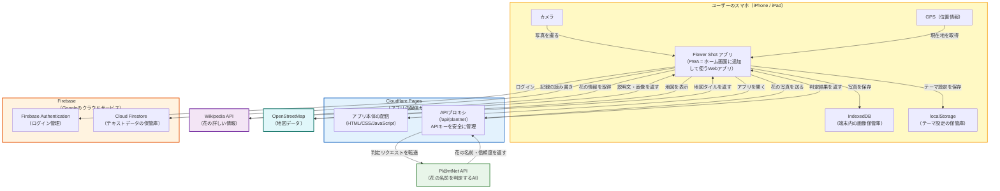

### 補足説明

| 用語 | 説明 |
|------|------|
| PWA | Progressive Web App の略。ブラウザで動くけど、ホーム画面に追加するとアプリのように使えるWebサイト |
| Cloudflare Pages | アプリの本体（画面やプログラム）を配信するサーバー。世界中に分散しているので高速 |
| APIプロキシ | アプリと外部サービスの間に入る「仲介役」。APIキー（パスワードのようなもの）を安全に管理する |
| Firebase Authentication | Google アカウントでのログインを管理するサービス |
| Cloud Firestore | Google が提供するデータベース。花の名前、撮影日時などのテキスト情報を保存 |
| IndexedDB | スマホの中にあるデータ保管庫。撮影した写真はここにだけ保存される |
| localStorage | スマホの中にある小さなメモ帳。テーマの色設定などを保存 |
| Pl@ntNet API | フランスの研究機関が提供する植物判定AI。写真を送ると花の名前を教えてくれる |

---

## 2. 画面遷移図

> **この図は何を表しているか:**
> アプリにどんな画面があり、どの画面からどの画面に移動できるかを示しています。矢印の上の文字は「何をしたらその画面に行くか」を表します。

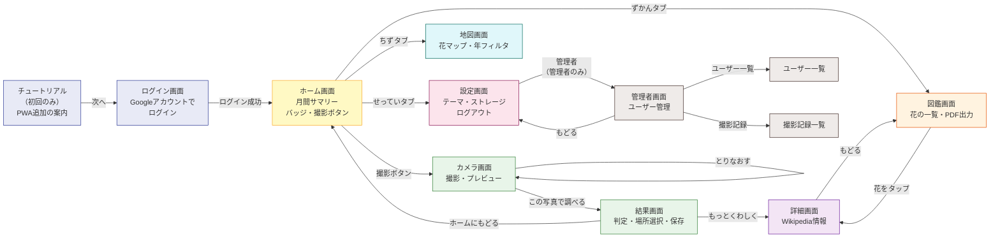

### 画面一覧

| 画面名 | URL | 対象ユーザー | 説明 |
|--------|-----|-------------|------|
| チュートリアル | `/tutorial` | 全員（初回のみ） | ホーム画面への追加方法を案内 |
| ログイン | `/login` | 全員 | Google アカウントでログイン |
| ホーム | `/` | 全員 | 今月の成果・バッジ・撮影ボタン |
| カメラ | `/camera` | 全員 | 花を撮影してプレビュー |
| 結果 | `/result` | 全員 | AI判定 → 場所選択 → 保存 |
| 詳細 | `/detail/:id` | 全員 | Wikipedia から花の情報を表示 |
| 図鑑 | `/collection` | 全員 | 撮影した花の一覧、PDFアルバム出力 |
| 地図 | `/map` | 全員 | 撮影場所を地図上にピン表示 |
| 設定 | `/settings` | 全員（漢字表記・大人向け） | テーマ変更・ストレージ確認・ログアウト |
| 管理者ダッシュボード | `/admin` | 管理者のみ | ユーザー管理・API使用量 |
| ユーザー一覧 | `/admin/users` | 管理者のみ | 全ユーザーの情報 |
| 撮影記録一覧 | `/admin/records` | 管理者のみ | 全撮影記録のテキスト情報 |

---

## 3. 撮影〜保存フロー図

> **この図は何を表しているか:**
> 花を撮影してから保存が完了するまでの流れを、ステップごとに詳しく示しています。ひし形は「分岐（条件によって進む道が変わるところ）」を表します。

```mermaid
flowchart TD
    Start(["ホーム画面で\n撮影ボタンをタップ"])

    subgraph Step1["ステップ1: 撮影"]
        OpenCamera["カメラが起動"]
        TakePhoto["花の写真を撮る"]
        Compress["画像を圧縮\n（最大幅1024px）"]
        Preview["プレビュー表示"]
        RetakeCheck{"撮り直す？"}
    end

    subgraph Step2["ステップ2: AI判定"]
        CheckLimit{"本日の判定回数\nを確認"}
        LimitOver["上限到達\n「きょうのおはなさがしは\nおしまい！」"]
        SendAPI["Pl@ntNet API に\n写真を送信"]
        Waiting["判定中...\nローディング表示"]
        CheckResult{"判定結果は？"}
        Found["花が見つかった\n信頼度 50%以上\n→ 確定表示"]
        Candidates["候補が見つかった\n信頼度 50%未満\n→ 最大3件を表示"]
        NotFound["花が見つからない\n「おはなが\nみつからなかったよ」"]
        SelectCandidate["ユーザーが\n候補から1つ選択"]
    end

    subgraph Step3["ステップ3: 場所選択"]
        AskLocation["「ばしょを きろくする？」"]
        LocationChoice{"場所の取得方法"}
        AutoGPS["「いまの ばしょ」\nGPS で自動取得"]
        MapPicker["「ちずで えらぶ」\n地図上でタップ"]
        GPSResult{"GPS取得\n成功？"}
        LocationSet["場所を設定完了"]
        SaveChoice{"保存方法を選択"}
    end

    subgraph Step4["ステップ4: 保存"]
        Saving["保存中..."]
        SaveFirestore["Firestore に\nテキスト情報を保存"]
        SaveIndexedDB["IndexedDB に\n写真を保存"]
    end

    subgraph Step5["ステップ5: 完了"]
        Done["「ほぞんできたよ！」"]
        AfterChoice{"次のアクション"}
        GoDetail["「もっと くわしく」\n→ 詳細画面へ"]
        GoHome["「ホームに もどる」\n→ ホーム画面へ"]
    end

    Start --> OpenCamera
    OpenCamera --> TakePhoto
    TakePhoto --> Compress
    Compress --> Preview
    Preview --> RetakeCheck
    RetakeCheck -->|"はい"| OpenCamera
    RetakeCheck -->|"いいえ\nこの写真で調べる"| CheckLimit

    CheckLimit -->|"残り回数あり"| SendAPI
    CheckLimit -->|"上限到達"| LimitOver
    SendAPI --> Waiting
    Waiting --> CheckResult

    CheckResult -->|"信頼度 50%以上"| Found
    CheckResult -->|"信頼度 50%未満"| Candidates
    CheckResult -->|"花が見つからない"| NotFound

    Found --> AskLocation
    Candidates --> SelectCandidate
    SelectCandidate --> AskLocation
    NotFound -->|"もういちど\nさつえいする"| OpenCamera

    AskLocation --> LocationChoice
    LocationChoice -->|"いまの ばしょ"| AutoGPS
    LocationChoice -->|"ちずで えらぶ"| MapPicker

    AutoGPS --> GPSResult
    GPSResult -->|"成功"| LocationSet
    GPSResult -->|"失敗"| MapPicker
    MapPicker --> LocationSet

    LocationSet --> SaveChoice
    LocationChoice -->|"ばしょなしで\nほぞんする"| Saving
    SaveChoice -->|"ばしょつきで\nほぞんする"| Saving

    Saving --> SaveFirestore
    SaveFirestore --> SaveIndexedDB
    SaveIndexedDB --> Done

    Done --> AfterChoice
    AfterChoice -->|"もっと くわしく"| GoDetail
    AfterChoice -->|"ホームに もどる"| GoHome

    style Step1 fill:#E8F5E9,stroke:#2E7D32,stroke-width:2px
    style Step2 fill:#E3F2FD,stroke:#1565C0,stroke-width:2px
    style Step3 fill:#FFF3E0,stroke:#E65100,stroke-width:2px
    style Step4 fill:#F3E5F5,stroke:#6A1B9A,stroke-width:2px
    style Step5 fill:#FFF9C4,stroke:#F9A825,stroke-width:2px
```

### 各ステップの補足

| ステップ | 何が起こるか | 関係するサービス |
|---------|------------|----------------|
| 1. 撮影 | カメラで写真を撮り、画像を小さく圧縮する | 端末のカメラ |
| 2. AI判定 | 写真をPl@ntNet APIに送り、花の名前を判定する | Cloudflare Pages Functions → Pl@ntNet API |
| 3. 場所選択 | GPS自動取得か地図タップで撮影場所を記録する（省略も可能） | 端末のGPS、OpenStreetMap |
| 4. 保存 | テキスト情報をFirestoreに、写真を端末のIndexedDBに保存する | Firebase Firestore、IndexedDB |
| 5. 完了 | 保存完了を表示し、詳細画面かホームに移動する | -- |

---

## 4. データベース構造図（Firestore）

> **この図は何を表しているか:**
> クラウド上のデータベース（Firestore）に保存される情報の構造を示しています。各テーブル（コレクション）にどんな項目（フィールド）があるかを一覧にしています。

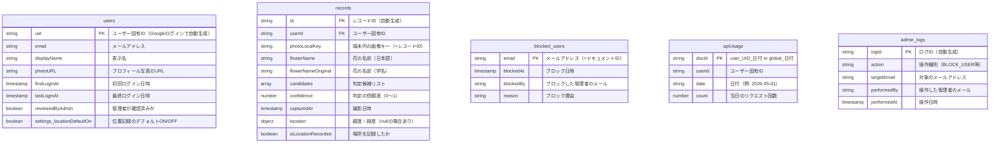

### コレクション（テーブル）の説明

| コレクション名 | 何を保存しているか | ドキュメント数の目安 |
|---------------|-------------------|-------------------|
| `users` | ログインしたユーザーの基本情報 | ユーザー数と同じ（約5件） |
| `records` | 花の撮影記録（名前、日時、場所など） | 撮影のたびに1件増加 |
| `blocked_users` | 利用停止されたユーザーのリスト | 通常は0件 |
| `apiUsage` | 花の判定を何回使ったかの記録（1日ごと） | ユーザー数 x 日数 + 日数 |
| `admin_logs` | 管理者が行った操作の記録 | 操作のたびに1件増加 |

### 用語の補足

| 用語 | 意味 |
|------|------|
| PK (Primary Key) | そのテーブルの中で一意（ユニーク）な識別子 |
| FK (Foreign Key) | 別のテーブルを参照するための値 |
| timestamp | 日時を記録する形式（例: 2026-05-01 14:30:00） |
| string | 文字列（テキスト） |
| number | 数値 |
| boolean | true（はい）または false（いいえ）の2択 |
| array | 複数の値をまとめたリスト |
| object | 複数の項目をまとめたデータの塊 |

---

## 5. ER図（エンティティ関連図）

> **この図は何を表しているか:**
> 各データテーブル間の「つながり（関連）」を示しています。例えば「1人のユーザーが複数の撮影記録を持つ」といった関係を線と記号で表現しています。

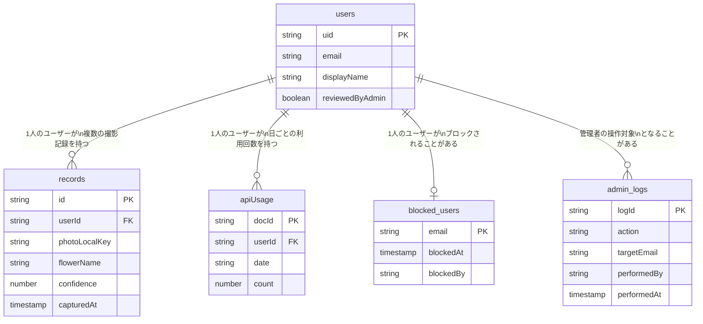

### 関連（リレーション）の読み方

| 記号 | 意味 |
|------|------|
| `\|\|` | 「ちょうど1つ」 |
| `o{` | 「0個以上（たくさんあり得る）」 |
| `o\|` | 「0個または1個」 |

| 関連 | 読み方 |
|------|--------|
| users → records | 1人のユーザーは、0件以上の撮影記録を持つ |
| users → apiUsage | 1人のユーザーは、日ごとに0件以上の利用回数記録を持つ |
| users → blocked_users | 1人のユーザーは、ブロックされる場合（0件）とされない場合（1件）がある |
| users → admin_logs | 管理者の操作対象として、0件以上のログに記録される |

---

## 6. 端末側データ構造図（IndexedDB）

> **この図は何を表しているか:**
> スマホの中（端末側）に保存されるデータの構造と、クラウド側のデータとの紐付けを示しています。写真はクラウドには送らず、端末の中だけに保存されます。

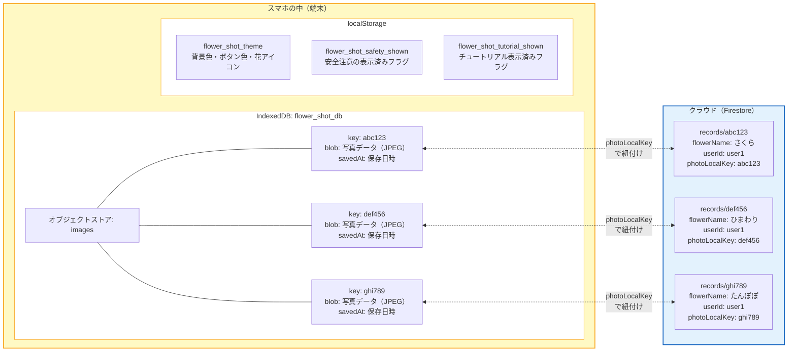

### 紐付けの仕組み

1. 花を保存する際、Firestore に新しいドキュメントを作り、そのID（例: `abc123`）を取得する
2. 同じID（`abc123`）をキーにして、端末の IndexedDB に写真を保存する
3. 花の記録を表示する際は、Firestore から名前や日時を取得し、同じキーで IndexedDB から写真を取り出す

### 重要な注意事項

| 項目 | 内容 |
|------|------|
| 写真はクラウドに保存されない | 撮影した写真はスマホの中にだけ存在する |
| 別の端末では写真が見えない | 写真はその端末にしかないため、別のスマホではプレースホルダー（代替画像）が表示される |
| アプリを削除すると写真が消える | IndexedDB のデータはアプリと一緒に消去される |
| 保存容量は約500枚 | iOS の IndexedDB は約1GBまで。1枚約2MBとして約500枚分 |

---

## 7. ユースケース図

> **この図は何を表しているか:**
> 「誰が」「何ができるか」をまとめた図です。このアプリには3種類の利用者（アクター）がいます。

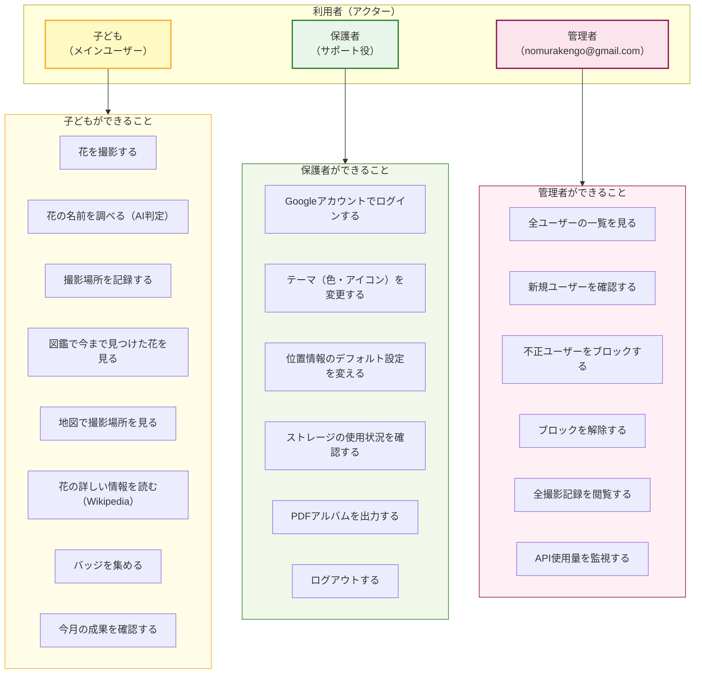

### アクター間の関係

| 関係 | 説明 |
|------|------|
| 子ども ⊂ 保護者 | 保護者は子どもと同じ機能を全て使える。加えて、設定変更やPDF出力もできる |
| 保護者 ⊂ 管理者 | 管理者は保護者と同じ機能を全て使える。加えて、ユーザー管理やAPI監視もできる |
| 共有アカウント | 保護者のGoogleアカウントを家族で共有して使う想定 |

### 各操作の詳細

| # | 操作 | 関連する画面 | 補足 |
|---|------|------------|------|
| C1 | 花を撮影する | ホーム → カメラ | 端末のカメラが起動する |
| C2 | 花の名前を調べる | 結果画面 | 1日100回まで。全ユーザー合計500回まで |
| C3 | 撮影場所を記録する | 結果画面（場所選択ステップ） | GPS自動取得 or 地図タップ。省略も可能 |
| C4 | 図鑑を見る | 図鑑画面 | 年別フィルタで絞り込み可能 |
| C5 | 地図を見る | 地図画面 | 位置情報がある撮影のみ表示 |
| C6 | 詳しい情報を読む | 詳細画面 | Wikipediaから自動取得 |
| C7 | バッジを集める | ホーム画面 | 1, 5, 10, 20, 50種類でバッジ獲得 |
| P1 | ログインする | ログイン画面 | Google SSO を使用 |
| P2 | テーマを変更する | 設定画面 | 背景7色、ボタン6色、花アイコン8種 |
| P5 | PDFアルバム出力 | 図鑑画面 | 年別または全件でPDF生成 |
| A3 | ブロックする | 管理者画面 | ブロックされたユーザーはログインできなくなる |

---

## 8. 認証・認可フロー図

> **この図は何を表しているか:**
> ユーザーがログインしてからアプリを使えるようになるまでの流れを示しています。途中で「このユーザーは使っていいか？」のチェックが入ります。

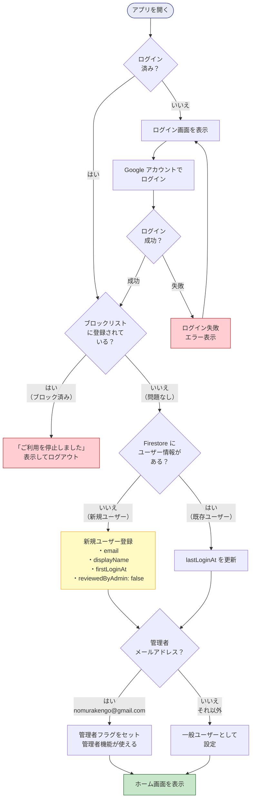

### 認証フローの補足

| 段階 | 説明 |
|------|------|
| ログイン確認 | アプリを開いたとき、Firebase Authentication が以前のログイン状態を自動的に復元する |
| ブロックチェック | Firestore の `blocked_users` コレクションにそのメールアドレスがないか確認する |
| 新規/既存判定 | Firestore の `users` コレクションにそのユーザーのIDがあるか確認する |
| 管理者判定 | メールアドレスが `nomurakengo@gmail.com` と一致するかどうかで判定する |

### 認証ガード（画面の保護）

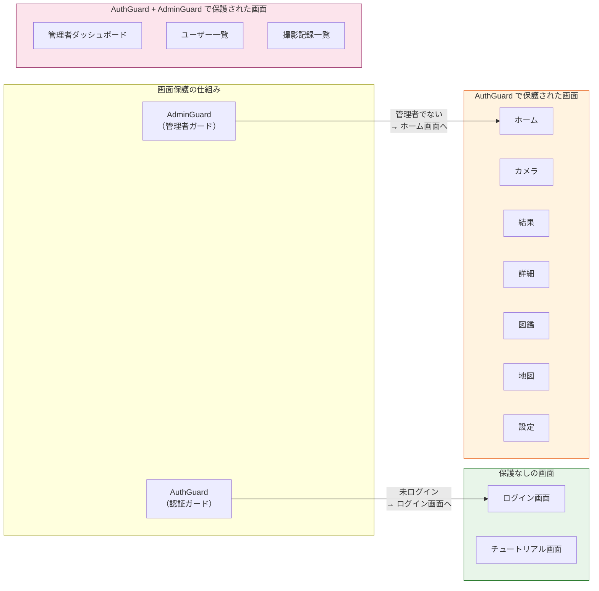

---

## 9. セキュリティモデル図

> **この図は何を表しているか:**
> 「誰が」「どのデータに」「何ができるか」をまとめた図です。データベースのセキュリティルール（アクセス制御）を視覚的に表現しています。

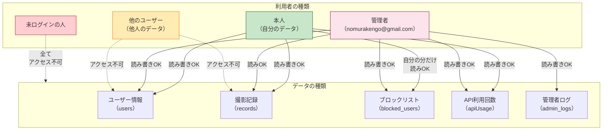

### アクセス権限の一覧表

| データ（コレクション） | 未ログイン | 本人 | 他のユーザー | 管理者 |
|----------------------|-----------|------|------------|--------|
| **ユーザー情報**（users） | 不可 | 読み書き可 | 不可 | 読み書き可 |
| **撮影記録**（records） | 不可 | 読み書き可 | 不可 | 読みのみ可 |
| **ブロックリスト**（blocked_users） | 不可 | 自分の分のみ読み可 | 不可 | 読み書き可 |
| **API利用回数**（apiUsage） | 不可 | 読み書き可 | 読み書き可 | 読み書き可 |
| **管理者ログ**（admin_logs） | 不可 | 不可 | 不可 | 読み書き可 |

### Firestore セキュリティルールの日本語説明

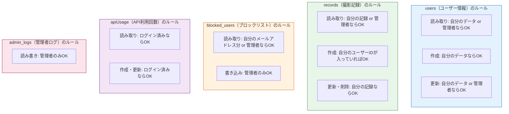

### その他のセキュリティ対策

| 対策 | 説明 |
|------|------|
| HTTPS通信 | アプリとサーバー間の通信は全て暗号化されている |
| APIキーの保護 | Pl@ntNet のAPIキーはサーバー側（Cloudflare Pages Functions）で管理し、スマホからは直接見えない |
| API利用回数制限 | 1ユーザー100回/日、全ユーザー合計500回/日まで |
| ブロック機能 | 不正利用が発覚した場合、管理者がそのユーザーのアクセスを即座に停止できる |
| 子どもの位置情報保護 | 撮影場所の情報は本人と管理者しか見られない。他のユーザーには公開されない |
| 画像のローカル保存 | 撮影写真はクラウドに送信されないため、写真の流出リスクを低減 |

---

## 付録: 用語集

| 用語 | 説明 |
|------|------|
| API | Application Programming Interface の略。あるサービスの機能を別のアプリから使うための窓口 |
| Firestore | Google が提供するクラウドデータベース。インターネット経由でデータの保存・読み取りができる |
| IndexedDB | Web ブラウザに組み込まれたデータ保管庫。大量のデータ（写真など）を端末内に保存できる |
| localStorage | Web ブラウザの小さなメモ帳。少量の設定値などを保存する |
| PWA | Progressive Web App の略。ホーム画面に追加するとネイティブアプリのように使えるWebサイト |
| SSO | Single Sign-On の略。Google のような既存のアカウントでログインする仕組み |
| ER図 | Entity-Relationship Diagram の略。データの種類と、それぞれの関連を示す図 |
| Mermaid | テキストで図を描くための記法。GitHub 上で自動的にグラフィカルな図に変換される |
| コレクション | Firestore におけるデータのグループ（フォルダのようなもの） |
| ドキュメント | Firestore におけるデータの1件分（ファイルのようなもの） |
| フィールド | ドキュメント内の各項目（Excel のセルのようなもの） |
| カーディナリティ | テーブル間の数量関係（1対1、1対多など） |
